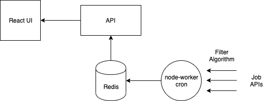

# Job Board App

> A simple job board web app that provides filtered jobs for people entering software industry

## Learnings

- React front end w/ Hooks
- Express REST API
- Redis Data Store
- Cron worker to fetch data
- Simple filtering algorithm
- Create Docker Images



## Technologies

- React JS
- Node JS
- Redis
- Nginx

## Getting Stared

These instructions will get you a copy of the project up and running on your local machine for development and testing purposes. See deployment for notes on how to deploy the project on a live system.

### Prerequisites

The required technologies are:

- Node >= version 10 [Download Link](https://nodejs.org/en/download/)
- Docker >= version 18 [Download Link](https://docs.docker.com/install/)
- Yarn [Installation Link](https://yarnpkg.com/lang/en/docs/install/)

### Installing

For the **dev environment**, please follow the instruction below

```
> make download-redis
> make setup-volume
> make start-redis

# Separate Terminal
> cd worker
> yarn install
> yarn start

# Separate Terminal
> cd api
> yarn install
> yarn start

# Separate Terminal
> cd client
> yarn install
> yarn start
```

Now, you can access

- UI in http://localhost:3000
- API in http://localhost:5000
- API Jobs http://localhost:5000/api/jobs/

## Deployment

For the production environment, please follow the instruction below

```
> make download-redis
> make setup-volume

> make run-job-board

# To Stop the containers
> make stop-job-board
```

## Authors

- Ajan Lal Shrestha - [AJRedDevil](https://github.com/AJRedDevil)

## License

This project is licensed under the GPL License - see the [LICENSE.md](https://gist.github.com/entry-level-software-jobs/LICENSE.md) file for details

## Acknowledgments

- Learnings from this [video](https://www.youtube.com/watch?v=lauywdXKEXI)
